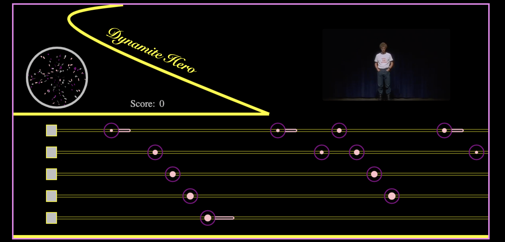
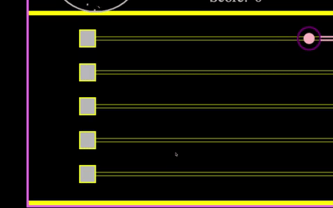
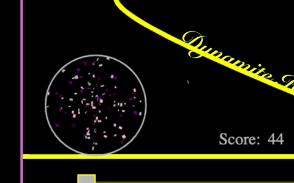

<p align="center">
  
</p>

## Background and Overview
Dynamite Hero is based off of guitar hero where you hit notes aligned with a song as they come at you. This time, you are playing to Napolean Dynamite's sweet moves! 

<a href="https://harryzec.github.io/Dynamite-Hero">Live Demo<a>

## Technologies
* Vanilla Javascript
* Canvas 

## Code Highlights
### Hitting Notes

There is a keydown Eventlistener and when the player hits a key that is designated for a specific button, the game lights up the button and checks to see if there is a collision between the x-axis of the left and right side of the buttons and notes (I gave people a little wiggle room).

```Javascript

    document.addEventListener("keydown", this.click, false);

    conflict(button) {
        if (this.x < button.right+8 && this.x > button.x-8) {
          return true;
        }
        return false;
      }

```

  

### Discoball

Using some circular motion, I developed a disco ball. the particles inside the ball change velocity based on your streak. A streak goes up to 3 and down to -3. The game starts you off at 0. 

```Javascript
if (current.game){
    this.ctx.clearRect(0, 0, this.dimensions.width, this.dimensions.height)
    
    this.particles.forEach(particle=>{
      particle.update(current.game.streak);
    })
}

update(strk) {
    if(strk === 0) {
      this.velocity = .04;
    } else if (strk ===1) {
      this.velocity =.05
    } else if (strk ===2) {
      this.velocity =.06
    } else if (strk ===3) {
      this.velocity =.07
    } else if (strk ===-1) {
      this.velocity =.04
    } else if (strk ===-2) {
      this.velocity =.03
    } else if (strk ===-3) {
      this.velocity =.02
    } 
```

  
